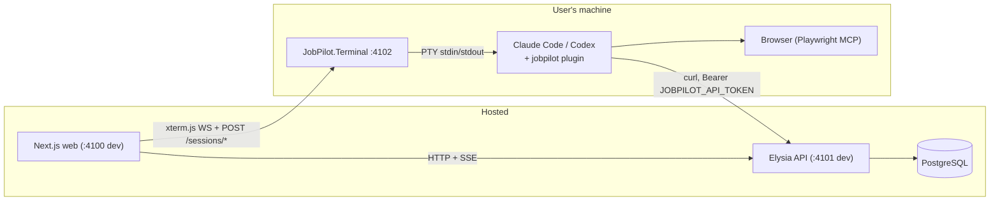
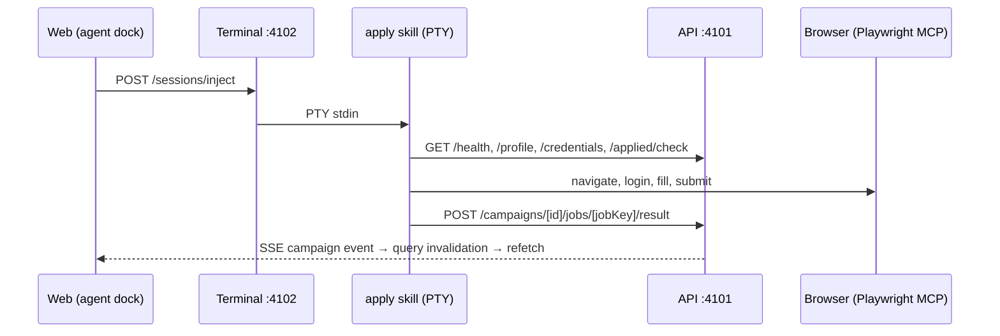

# Development reference

Technical reference for contributors. For the plain-language overview, see
[architecture.md](architecture.md).

## Local setup

```bash
git clone https://github.com/suxrobgm/jobpilot.git
cd jobpilot
bun install
bun run db:setup # generates the Prisma client, runs migrations, seeds default data
bun run dev      # web :4100 + api :4101 + terminal :4102
```

There is no local database container. Before running `db:setup`, point
`DATABASE_URL` in [apps/api/.env](../apps/api/.env) at a PostgreSQL you can
reach, either one you run yourself or the remote database through the SSH
tunnel described below.

Open `http://localhost:4100` and toggle the Terminal panel.

### Remote database (SSH tunnel)

To point the API at a remote PostgreSQL, open an SSH tunnel and target it
locally. Set the `SSH_TUNNEL_*` / `REMOTE_DB_*` / `LOCAL_DB_PORT` vars in
[apps/api/.env](../apps/api/.env) (see
[apps/api/.env.example](../apps/api/.env.example)), then:

```bash
bun run db:tunnel   # binds localhost:5433 -> remote db through the SSH host; Ctrl+C to close
```

With the tunnel up, set `DATABASE_URL=postgresql://<user>:<pass>@localhost:5433/<db>`
in [apps/api/.env](../apps/api/.env). `db:setup`, `db:studio`, and the API all
then run against the remote DB. Set `REMOTE_DB_HOST` to `127.0.0.1` when the
database runs on the SSH server itself, or to its private host when tunneling
via a bastion.

## Repository layout

- [apps/web/](../apps/web/): hosted Next.js dashboard (dev `:4100`).
- [apps/api/](../apps/api/): hosted Bun + Elysia + Prisma API; owns all state
  (dev `:4101`, Swagger at `/swagger`).
- [apps/terminal/](../apps/terminal/): .NET host that runs on each user's
  machine and bridges one Claude Code / Codex PTY to the dashboard
  (dev `:4102`).
- [plugin/](../plugin/): one provider-neutral plugin for both Claude Code and
  Codex, holding skills, worker subagents, and the Playwright MCP config. No
  build step.
- [packages/](../packages/): shared Zod contracts and the typed Eden Treaty
  API client.

## Tech stack

| Layer              | Choice                                         |
| ------------------ | ---------------------------------------------- |
| Runtime            | Bun 1.3                                        |
| Web                | Next.js 16 (App Router, RSC, typed routes)     |
| UI                 | MUI 9 + MUI X DataGrid                         |
| Forms              | TanStack Form 1 + Zod v4                       |
| Server state       | TanStack Query 5                               |
| API                | Elysia + Eden Treaty (end-to-end types)        |
| Database           | PostgreSQL via Prisma 7 + `@prisma/adapter-pg` |
| Realtime           | In-process SSE channels                        |
| Terminal host      | .NET 10 ASP.NET Core, ConPTY via Quick.PtyNet  |
| Browser automation | Playwright via the Playwright MCP server       |

## Architecture internals

Hosted multi-user web + API; a terminal host and provider plugin on each
user's machine. The local agent authenticates as the signed-in user via a
personal access token the terminal injects into the PTY.

### Topology



### Components

- **[apps/web/](../apps/web/)**: Next.js UI covering the pipeline, campaigns
  with live per-job progress, inbox, networking, resume studio, Upwork,
  analytics, settings, and the agent dock (an xterm.js panel that installs,
  launches, and monitors the local agent). Browser and server both call the
  API directly via `API_BASE_URL`, with no proxy in between.
- **[apps/api/](../apps/api/)**: Elysia + Prisma; owns all state. Typed
  `/api/*` surface, Swagger at `/swagger`, Prisma schema split per domain
  under `apps/api/prisma/schema/`.
- **[apps/terminal/](../apps/terminal/)**: ASP.NET Core minimal API owning
  one provider PTY (ConPTY via Quick.PtyNet), bridged to the web's xterm.js
  over WebSocket. Endpoints: `POST /sessions/start`, `POST /sessions/inject`,
  `DELETE /sessions/current`, `GET /healthz`, `GET /ws`. `/sessions/start`
  takes the user's terminal token and spawns the provider with
  `JOBPILOT_API_TOKEN`, `JOBPILOT_API`, `JOBPILOT_WEB` (plus
  `JOBPILOT_SKILLS_ROOT` / `JOBPILOT_WORKSPACE_ROOT` for wrappers), so skills
  authenticate with zero manual setup.

One Terminal instance owns one PTY. It survives tab close: reopening the panel
reattaches a WebSocket to the live session and replays the buffered tail
(`TerminalHub`, 512 KB, cleared when a new session starts). Switching providers
restarts the PTY. The web injects commands as `/jobpilot:<skill>` for Claude and
`$<skill>` for Codex. On a new release the agent dock shows an update banner;
the guided flow updates host + plugin and finishes with `/reload-plugins` on
Claude.

### Plugin loading

[plugin/](../plugin/) is one provider-neutral tree, no generation step:

- `skills/<name>/SKILL.md`: one workflow per directory; shared docs in
  `skills/_shared/` (no `SKILL.md`, so neither provider lists them as skills).
  Skills reference siblings by name and shared docs by relative path
  (`../_shared/<doc>.md`), so the same text serves both providers.
- `agents/*.md`: worker subagents (`job-worker`, `networking-worker`) that
  campaign skills delegate per-iteration work to, isolating heavy browser
  output. Claude auto-discovers them; [.codex/agents/](../.codex/agents/)
  point at the same `.md` bodies. Runtimes without subagents run inline.
- `.mcp.json`: Playwright MCP server.
- `.claude-plugin/plugin.json` + `.codex-plugin/plugin.json`: provider
  manifests (Codex ignores Claude-only frontmatter like `allowed-tools`).
- `settings/claude.json` + `settings/codex.json`: shipped agent config. Not
  `settings.json` at the plugin root: that name is reserved and honors only the
  `agent` and `subagentStatusLine` keys.

The terminal launches
`claude --permission-mode auto --settings plugin/settings/claude.json --plugin-dir plugin`
or `codex --no-alt-screen -C <root> --approve-for-me -c <override>`. Both run
under automatic approval review, so a blocked action prompts in the dashboard
terminal. `settings/claude.json` pins Sonnet and describes the JobPilot API
under `autoMode.environment`. Codex has no `--settings` flag, and a project
`.codex/config.toml` loads only for trusted projects, so
[AgentSettings](../apps/terminal/Hosting/AgentSettings.cs) expands
`settings/codex.json` into `-c` arguments. A missing file logs a warning and
still launches.

Codex has no `--plugin-dir` either. Before launch, the host mirrors the bundled
skill tree into `<root>/.agents/skills`, Codex's repository-local discovery
location (excluding the marketplace-owned `setup` bootstrap) and translates
the bundled `.mcp.json` into `-c mcp_servers.*` overrides. The publish output
also bundles `.codex/agents/*.toml` for worker parity. Both provider
marketplaces contain only `setup`; the full runtime tree comes from the host.
The bootstraps are published to the
[claude-plugins](https://github.com/suxrobGM/claude-plugins) and
[codex-plugins](https://github.com/suxrobGM/codex-plugins) marketplaces, synced
from `plugin/` each release tag. Root `.claude/settings.json` is repo trust
policy; the plugin owns behavior.

### Apply lifecycle



### Live updates

Skills mutate through `/api/campaigns/*`; the web opens
`EventSource /api/campaigns/[id]/events` and invalidates the TanStack Query
cache on each event, refetching canonical state from PostgreSQL. Five more
channels (`workspace`, `inbox`, `resume`, `upwork`, `pilot`) follow the same
pattern; they are defined in `packages/contracts/src/sse/channels/`.

### Skills layer

`plugin/skills/_shared/setup.md` is the single source of truth for config
loading: `/api/health` → `GET /api/user` (the bare payload, no `data.` wrapper)
→ `GET /api/credentials/resolve?domain=…`; resumes via
`primaryResumeSourceAbsolutePath` or `GET /api/resumes/[id]/pdf`. `auth.md`,
`form-filling.md`, and `browser-tips.md` cover cross-cutting browser behavior;
`campaign-flow.md` holds the campaign mechanics every apply skill shares
(applied-check, result writes, worker input, rules); the writing skills chain
the `humanizer` skill by name, in **embedded mode** so only the final text comes
back.

The resume skills form a chain, one rule each:

- `extract-resume` parses the PDF into `ResumeData` verbatim, improving
  nothing and inventing no fields. Chains `review-resume` on a *first*
  extraction only; `--force` skips it, since the user asked for what the PDF
  says.
- `review-resume` writes one `Suggested rewrite` variant whose `diffNotes` list
  every change. It never touches a base; the dashboard's Apply action does that
  via `POST /api/resumes/variants/[id]/apply`, which copies the content onto the
  base and deletes the variant in one transaction, so the suggestion is never
  applied while still being offered. The stored source PDF is the way back.
- `tailor-resume` owns per-job variants: base selection, the reuse-vs-create
  score, rewording any entry, and `structure` (reorder, drop, merge, promote
  projects).

The guards in `apps/api/src/modules/resume/structure.ts` are the design: the
model picks *which* entries combine, the server derives every date and
whitelists umbrella employer names, so no request can add an employer or widen a
range. The numbers guard in `rewrite.ts` covers every reworded bullet.
