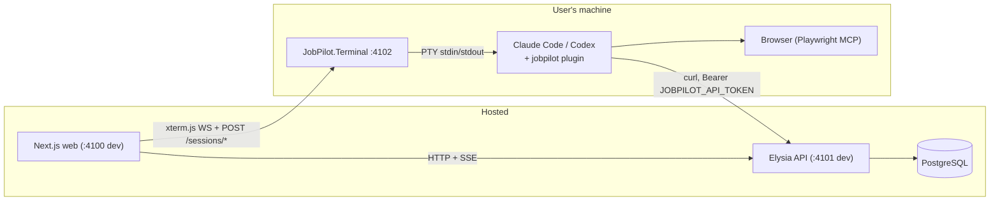
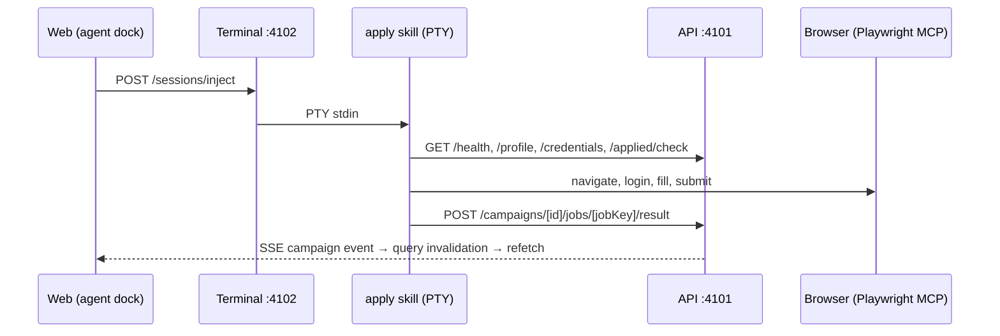

# Development reference

Technical reference for contributors. For the plain-language overview, see
[architecture.md](architecture.md).

## Local setup

```bash
git clone https://github.com/suxrobgm/jobpilot.git
cd jobpilot
bun install
bun run db:up    # starts the local PostgreSQL container (Docker)
bun run db:setup # generates the Prisma client, runs migrations, seeds default data
bun run dev      # web :4100 + api :4101 + terminal :4102
```

Open `http://localhost:4100` and toggle the Terminal panel.

### Remote database (SSH tunnel)

To point the API at a remote PostgreSQL, open an SSH tunnel and target it
locally. Set the `SSH_TUNNEL_*` / `REMOTE_DB_*` / `LOCAL_DB_PORT` vars in
[apps/api/.env](../apps/api/.env) (see
[apps/api/.env.example](../apps/api/.env.example)), then:

```bash
bun run db:tunnel   # binds localhost:5433 -> remote db through the SSH host; Ctrl+C to close
```

With the tunnel up, set `DATABASE_URL=postgresql://<user>:<pass>@localhost:5433/<db>`
in [apps/api/.env](../apps/api/.env). `db:setup`, `db:studio`, and the API all
then run against the remote DB. Set `REMOTE_DB_HOST` to `127.0.0.1` when the
database runs on the SSH server itself, or to its private host when tunneling
via a bastion.

## Repository layout

- [apps/web/](../apps/web/) - hosted Next.js dashboard (dev `:4100`).
- [apps/api/](../apps/api/) - hosted Bun + Elysia + Prisma API; owns all state
  (dev `:4101`, Swagger at `/swagger`).
- [apps/terminal/](../apps/terminal/) - .NET host that runs on each user's
  machine and bridges one Claude Code / Codex PTY to the dashboard
  (dev `:4102`).
- [plugin/](../plugin/) - one provider-neutral plugin for both Claude Code and
  Codex: skills, worker subagents, and the Playwright MCP config. No build
  step.
- [packages/](../packages/) - shared Zod contracts and the typed Eden Treaty
  API client.

## Tech stack

| Layer              | Choice                                         |
| ------------------ | ---------------------------------------------- |
| Runtime            | Bun 1.3                                        |
| Web                | Next.js 16 (App Router, RSC, typed routes)     |
| UI                 | MUI 9 + MUI X DataGrid                         |
| Forms              | TanStack Form 1 + Zod v4                       |
| Server state       | TanStack Query 5                               |
| API                | Elysia + Eden Treaty (end-to-end types)        |
| Database           | PostgreSQL via Prisma 7 + `@prisma/adapter-pg` |
| Realtime           | In-process SSE channels                        |
| Terminal host      | .NET 10 ASP.NET Core, ConPTY via Quick.PtyNet  |
| Browser automation | Playwright via the Playwright MCP server       |

## Architecture internals

Hosted multi-user web + API; a terminal host and provider plugin on each
user's machine. The local agent authenticates as the signed-in user via a
personal access token the terminal injects into the PTY.

### Topology



### Components

- **[apps/web/](../apps/web/)** - Next.js UI: pipeline, campaigns with live
  per-job progress, inbox, networking, resume studio, Upwork, analytics,
  settings, and the agent dock (an xterm.js panel that installs, launches,
  and monitors the local agent). Browser and server both call the API
  directly via `API_BASE_URL` - no proxy.
- **[apps/api/](../apps/api/)** - Elysia + Prisma; owns all state. Typed
  `/api/*` surface, Swagger at `/swagger`, Prisma schema split per domain
  under `apps/api/prisma/schema/`.
- **[apps/terminal/](../apps/terminal/)** - ASP.NET Core minimal API owning
  one provider PTY (ConPTY via Quick.PtyNet), bridged to the web's xterm.js
  over WebSocket. Endpoints: `POST /sessions/start`, `POST /sessions/inject`,
  `DELETE /sessions/current`, `GET /healthz`, `GET /ws`. `/sessions/start`
  takes the user's terminal token and spawns the provider with
  `JOBPILOT_API_TOKEN`, `JOBPILOT_API`, `JOBPILOT_WEB` (plus
  `JOBPILOT_SKILLS_ROOT` / `JOBPILOT_WORKSPACE_ROOT` for wrappers) - skills
  authenticate with zero manual setup.

One Terminal instance owns one PTY. It survives tab close (reopening the
panel reattaches a WebSocket to the live session); switching providers
restarts the PTY; there is no replay buffer. The web injects commands as
`/jobpilot:<skill>` for Claude and `$<skill>` for Codex. On a new release the
agent dock shows an update banner; the guided flow updates host + plugin and
finishes with `/reload-plugins` on Claude.

### Plugin loading

[plugin/](../plugin/) is one provider-neutral tree, no generation step:

- `skills/<name>/SKILL.md` - one workflow per directory; shared docs in
  `shared/`. Skills reference siblings by name and shared docs by
  relative path, so the same text serves both providers.
- `agents/*.md` - worker subagents (`job-worker`, `networking-worker`) that
  campaign skills delegate per-iteration work to, isolating heavy browser
  output. Claude auto-discovers them; [.codex/agents/](../.codex/agents/)
  point at the same `.md` bodies. Runtimes without subagents run inline.
- `.mcp.json` - Playwright MCP server.
- `.claude-plugin/plugin.json` + `.codex-plugin/plugin.json` - provider
  manifests (Codex ignores Claude-only frontmatter like `allowed-tools`).

The terminal launches `claude --plugin-dir plugin` or
`codex --no-alt-screen -C <root>`. Codex has no `--plugin-dir`; dashboard
sessions reuse the plugin the user explicitly installed from the public
marketplace under the same OS user and `CODEX_HOME`. The terminal publish
output still bundles `plugin/` for Claude and for the shared worker resources
addressed through `JOBPILOT_SKILLS_ROOT`, plus `.codex/agents/*.toml` for
Codex worker discovery. It does not expose a repo-local Codex marketplace.
Standalone installs come from the
[claude-plugins](https://github.com/suxrobGM/claude-plugins) /
[codex-plugins](https://github.com/suxrobGM/codex-plugins) marketplaces,
synced from `plugin/` on each release tag: Claude receives the setup bootstrap
and Codex receives the full skill tree, its `shared/` references, and MCP
configuration. Root
`.claude/settings.json` grants the permissions the skills need - the plugin
owns behavior, the repo owns trust policy.

### Apply lifecycle



### Live updates

Skills mutate through `/api/campaigns/*`; the web opens
`EventSource /api/campaigns/[id]/events` and invalidates the TanStack Query
cache on each event, refetching canonical state from PostgreSQL. Four more
channels (`inbox`, `pipeline`, `resume`, `upwork`) follow the same pattern.

### Skills layer

`plugin/shared/setup.md` is the single source of truth for config
loading: `/api/health` → `GET /api/profile` → `GET /api/credentials`; resumes
via `data.defaultResumeAbsolutePath` or `GET /api/resumes/[id]/file`.
`auth.md`, `form-filling.md`, and `browser-tips.md` cover cross-cutting
browser behavior; the writing skills chain the `humanizer` skill by name.
